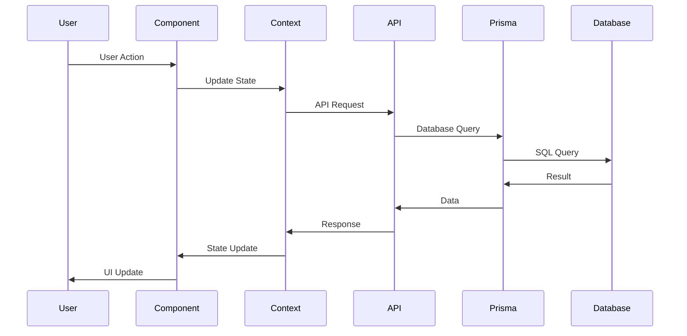

# Family Hub - Technical Architecture

## Overview

Family Hub is a Progressive Web Application (PWA) built with TanStack Start, React, and Prisma ORM. It provides household management features including meal planning, shopping lists, task/chore management, and calendar events.

## Technology Stack

### Core Framework

- **TanStack Start** (v1.132.0) - Full-stack React framework with SSR support
- **React** (v19.2.0) - UI library
- **TypeScript** (v5.7.2) - Type safety

### Routing & Navigation

- **TanStack Router** (v1.132.0) - File-based routing with type safety
- File-based route structure in `src/routes/`
- Auto-generated route tree (`routeTree.gen.ts`)

### Data Layer

- **Prisma** (v7.0.0) - Type-safe ORM
- **PostgreSQL** (via Supabase) - Relational database
- **Prisma Client** - Generated database client

### State Management

- **React Context API** - Global state management
  - `HouseholdContext` - Household members management
  - `TasksContext` - Tasks and completion tracking
- **localStorage** (legacy) - Currently used, migrating to database

### UI & Styling

- **Tailwind CSS** (v4.0.6) - Utility-first CSS framework
- **Radix UI** - Headless UI components (accordion, dialog, select, etc.)
- **Lucide React** - Icon library
- **shadcn/ui** - Component library built on Radix UI

### Build & Tooling

- **Vite** (v7.1.7) - Build tool and dev server
- **Nitro** - Server-side rendering and API routes
- **Vitest** - Testing framework
- **dotenv-cli** - Environment variable management

### PWA Support

- **Service Worker** (`public/sw.js`) - Offline support and asset caching
- **Web App Manifest** (`public/manifest.json`) - PWA installation metadata

## Project Structure

```
family-hub/
├── prisma/
│   ├── schema.prisma          # Database schema definition
│   └── migrations/            # Database migrations (auto-generated)
├── public/
│   ├── manifest.json          # PWA manifest
│   ├── sw.js                  # Service worker
│   └── [assets]               # Static assets
├── src/
│   ├── components/
│   │   ├── Header.tsx         # Main navigation header
│   │   └── ui/                # Reusable UI components (shadcn)
│   ├── contexts/
│   │   ├── HouseholdContext.tsx  # Household members state
│   │   └── TasksContext.tsx      # Tasks and completions state
│   ├── routes/
│   │   ├── __root.tsx         # Root route with providers
│   │   ├── index.tsx          # Dashboard
│   │   ├── meals.tsx          # Meal planning
│   │   ├── shopping.tsx       # Shopping lists
│   │   ├── tasks.tsx          # Tasks & chores management
│   │   ├── my-chores.tsx      # Kid-friendly chores view
│   │   ├── calendar.tsx       # Calendar events
│   │   └── settings.tsx       # Settings & household members
│   ├── db.ts                  # Prisma client initialization
│   ├── router.tsx             # Router configuration
│   ├── routeTree.gen.ts       # Auto-generated route tree
│   └── utils/
│       └── registerServiceWorker.ts  # PWA service worker registration
├── vite.config.ts             # Vite configuration
├── prisma.config.ts           # Prisma configuration
└── package.json               # Dependencies and scripts
```

## Architecture Layers


## Data Layer Architecture

### Database Schema

**Models:**

- `HouseholdMember` - Family members with roles and colors
- `Task` - Tasks and chores (one-time and recurring)
- `CompletionRecord` - Completion history for recurring tasks
- `Meal` - Meal planning entries
- `ShoppingItem` - Shopping list items
- `CalendarEvent` - Calendar events (one-time and recurring)

**Key Relationships:**

- `Task.assignedToId` → `HouseholdMember.id` (optional)
- `CompletionRecord.taskId` → `Task.id` (cascade delete)
- `CompletionRecord.completedById` → `HouseholdMember.id` (cascade delete)

### Prisma Client

**Location:** `src/db.ts`

**Features:**

- Singleton pattern (prevents multiple instances in dev)
- Environment-based logging
- Connection string validation
- Global instance for hot reload compatibility

**Usage Pattern:**

```typescript
import { prisma } from "../db";

// Query example
const tasks = await prisma.task.findMany({
  where: { assignedToId: memberId },
  include: { assignedTo: true },
});
```

## State Management Architecture

### Context Providers

**HouseholdContext** (`src/contexts/HouseholdContext.tsx`)

- Manages household members
- CRUD operations for members
- localStorage persistence (migrating to database)
- Color assignment logic

**TasksContext** (`src/contexts/TasksContext.tsx`)

- Manages tasks and completion records
- Handles one-time vs recurring task logic
- Completion tracking and streak calculation
- localStorage persistence (migrating to database)

### Provider Hierarchy


**Implementation:**

- Providers wrap the app in `__root.tsx`
- Components access state via `useHousehold()` and `useTasks()` hooks
- State persists to localStorage (temporary, migrating to database)

## Routing Architecture

### File-Based Routing

TanStack Router uses file-based routing where file structure maps to URL structure:

- `src/routes/index.tsx` → `/`
- `src/routes/meals.tsx` → `/meals`
- `src/routes/tasks.tsx` → `/tasks`
- `src/routes/my-chores.tsx` → `/my-chores`
- `src/routes/shopping.tsx` → `/shopping`
- `src/routes/calendar.tsx` → `/calendar`
- `src/routes/settings.tsx` → `/settings`

### Route Configuration

**Router Setup** (`src/router.tsx`):

- Creates router instance with route tree
- Configures scroll restoration
- Sets preload stale time

**Root Route** (`src/routes/__root.tsx`):

- Defines HTML shell
- Sets up providers
- Configures PWA meta tags
- Registers service worker

## Component Architecture

### Component Hierarchy

```
RootDocument
├── HouseholdProvider
│   └── TasksProvider
│       ├── Header (Navigation)
│       └── Route Components
│           ├── Dashboard
│           ├── MealPlanning
│           ├── ShoppingLists
│           ├── TasksAndChores
│           ├── MyChores
│           ├── Calendar
│           └── Settings
```

### UI Components

**Location:** `src/components/ui/`

**Pattern:** shadcn/ui components built on Radix UI primitives

- Accessible by default
- Fully customizable
- Type-safe props
- Composable design

**Key Components:**

- Form controls (Input, Select, Textarea, Checkbox)
- Layout (Card, Dialog, Sheet, Tabs)
- Feedback (Alert, Toast/Sonner)
- Navigation (Breadcrumb, Navigation Menu)

## PWA Architecture

### Service Worker Strategy

**File:** `public/sw.js`

**Caching Strategy:**

- **Network-First** for API/data requests (fresh data required)
- **Cache-First** for app shell (HTML, CSS, JS)
- **Cache-First** for static assets (images, fonts)

**Offline Behavior:**

- App shell loads from cache (offline-capable)
- Data requests fail gracefully (show offline indicator)
- No API response caching (data must be fresh)

### PWA Configuration

**Manifest** (`public/manifest.json`):

- App name, icons, theme colors
- Standalone display mode
- App shortcuts (Shopping, Chores, Meals)

**Meta Tags** (`__root.tsx`):

- Viewport configuration
- Theme color
- Apple touch icons
- Mobile app capabilities

**Registration** (`src/utils/registerServiceWorker.ts`):

- Auto-registers on app load
- Handles updates automatically
- Reloads when new version available

## Data Flow

### Current Flow (localStorage)


### Target Flow (Database)



## Build & Deployment

### Build Process

**Development:**

```bash
npm run dev  # Vite dev server on port 3000
```

**Production Build:**

```bash
npm run build  # Vite + Nitro build
```

**Output:**

- Static assets in `.output/public/`
- Server-side code in `.output/server/`
- Prisma client generated to `node_modules/.prisma/client/`

### Database Operations

**Scripts:**

- `db:generate` - Generate Prisma client
- `db:push` - Push schema to database (dev)
- `db:migrate` - Create and run migrations
- `db:studio` - Open Prisma Studio (GUI)
- `db:seed` - Seed database with initial data

### Deployment Targets

**Recommended:** Vercel or Netlify

- Automatic HTTPS (required for PWA)
- Global CDN
- Serverless functions support
- Easy Git-based deployment

## Key Design Decisions

### 1. File-Based Routing

**Why:** TanStack Router's file-based routing provides type safety and automatic route generation, reducing boilerplate.

### 2. Context API for State

**Why:** Simple, built-in React solution. Sufficient for current scope. Can migrate to Zustand/Redux if needed later.

### 3. Prisma ORM

**Why:** Type-safe database access, excellent TypeScript support, migration system, works well with PostgreSQL.

### 4. Network-First Service Worker

**Why:** Data requires fresh database queries. App shell cached for offline loading, but data always fetched from network.

### 5. Separate Contexts

**Why:** Clear separation of concerns. HouseholdContext manages members, TasksContext manages tasks/completions. Can be combined later if needed.

### 6. UUID Primary Keys

**Why:** Better for distributed systems, no collision risk, works well with Prisma and PostgreSQL.

## Future Architecture Considerations

### Planned Enhancements

1. **API Layer**
   - Add API routes using TanStack Start server functions
   - RESTful or tRPC endpoints
   - Authentication middleware

2. **Real-time Updates**
   - Supabase real-time subscriptions
   - WebSocket connections
   - Live data sync across devices

3. **Offline Support**
   - IndexedDB for offline data storage
   - Background sync for queued actions
   - Conflict resolution strategies

4. **Authentication**
   - Supabase Auth integration
   - Multi-household support
   - User roles and permissions

5. **State Management**
   - Consider Zustand or TanStack Query
   - Server state vs client state separation
   - Optimistic updates

## Performance Considerations

### Current Optimizations

- **Code Splitting:** Vite automatic code splitting
- **Tree Shaking:** Unused code eliminated
- **Asset Optimization:** Vite handles image/font optimization
- **Database Indexes:** Proper indexes on query fields
- **Service Worker Caching:** App shell cached for fast loads

### Future Optimizations

- **React Query:** Server state caching and synchronization
- **Virtual Scrolling:** For large lists (tasks, meals)
- **Image Optimization:** Next-gen formats, lazy loading
- **Database Query Optimization:** Eager loading, pagination
- **CDN Caching:** Static assets on CDN

## Security Considerations

### Current State

- **HTTPS Required:** PWA requires secure context
- **Environment Variables:** Sensitive data in `.env.local`
- **No Authentication:** Single-household app (for now)
- **Client-Side Validation:** Zod schemas for form validation

### Future Security

- **Authentication:** Supabase Auth
- **Authorization:** Row-level security policies
- **Input Validation:** Server-side validation
- **Rate Limiting:** API rate limits
- **CORS:** Proper CORS configuration

## Development Workflow

### Local Development

1. **Setup:**

   ```bash
   npm install
   cp .env.example .env.local
   # Add DATABASE_URL to .env.local
   npm run db:generate
   npm run db:push
   ```

2. **Development:**

   ```bash
   npm run dev
   # App runs on http://localhost:3000
   ```

3. **Database Changes:**
   ```bash
   # Edit prisma/schema.prisma
   npm run db:push  # Dev: push changes
   # OR
   npm run db:migrate  # Prod: create migration
   ```

### Testing

- **Unit Tests:** Vitest (configured, not yet implemented)
- **Component Tests:** React Testing Library (configured)
- **E2E Tests:** (Not yet implemented)

## Dependencies Overview

### Core Dependencies

- `@tanstack/react-start` - Full-stack framework
- `@tanstack/react-router` - Routing
- `@prisma/client` - Database client
- `react` / `react-dom` - UI library

### UI Dependencies

- `@radix-ui/*` - Headless UI primitives
- `tailwindcss` - Styling
- `lucide-react` - Icons
- `class-variance-authority` - Component variants

### Utility Dependencies

- `zod` - Schema validation
- `date-fns` - Date manipulation
- `clsx` / `tailwind-merge` - Class name utilities

## Environment Variables

### Required

- `DATABASE_URL` - PostgreSQL connection string (Supabase)

### Optional

- `NODE_ENV` - Environment (development/production)

## Database Schema Summary

### Tables

1. **household_members** - Family members
2. **tasks** - Tasks and chores
3. **completion_records** - Chore completion history
4. **meals** - Meal planning entries
5. **shopping_items** - Shopping list items
6. **calendar_events** - Calendar events

### Key Indexes

- `household_members.name` - Member lookup
- `tasks.assignedToId` - Task assignment queries
- `tasks.recurrence` - Recurring task filtering
- `completion_records.taskId` - Completion history
- `completion_records.completedAt` - Date-based queries
- `meals.date` - Date range queries
- `shopping_items.category` - Category filtering
- `calendar_events.date` - Date-based event queries

## API Design (Future)

### Planned Endpoints

```
GET    /api/household/members
POST   /api/household/members
PUT    /api/household/members/:id
DELETE /api/household/members/:id

GET    /api/tasks
POST   /api/tasks
PUT    /api/tasks/:id
DELETE /api/tasks/:id
POST   /api/tasks/:id/complete

GET    /api/meals?startDate=&endDate=
POST   /api/meals
DELETE /api/meals/:id

GET    /api/shopping
POST   /api/shopping
PUT    /api/shopping/:id
DELETE /api/shopping/:id

GET    /api/calendar?startDate=&endDate=
POST   /api/calendar
DELETE /api/calendar/:id
```

## Error Handling

### Current State

- **Client-Side:** Try-catch blocks in contexts
- **Form Validation:** Zod schemas
- **Database:** Prisma error handling

### Future Enhancements

- **Error Boundaries:** React error boundaries
- **Error Logging:** Sentry or similar
- **User-Friendly Messages:** Error message components
- **Retry Logic:** Automatic retry for failed requests

## Monitoring & Observability

### Current State

- **Development:** TanStack Devtools
- **Logging:** Console logs
- **No Production Monitoring:** (Not yet implemented)

### Future Considerations

- **Error Tracking:** Sentry
- **Performance Monitoring:** Web Vitals
- **Analytics:** Privacy-friendly analytics
- **Database Monitoring:** Supabase dashboard

---

**Last Updated:** January 2026
**Version:** 1.0.0
**Status:** Active Development
